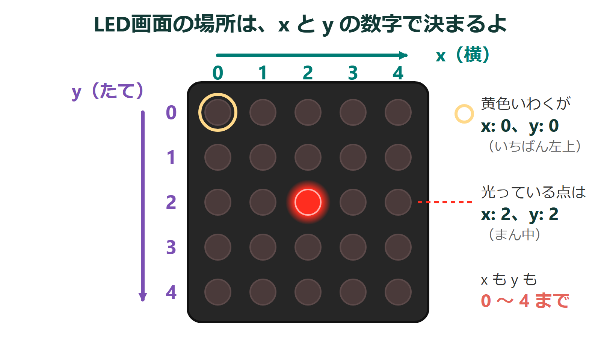
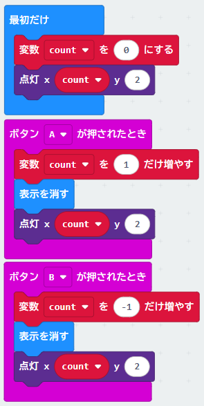
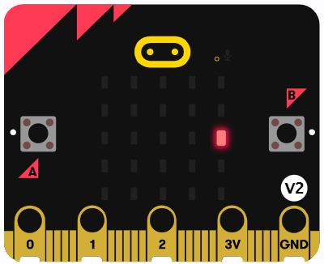
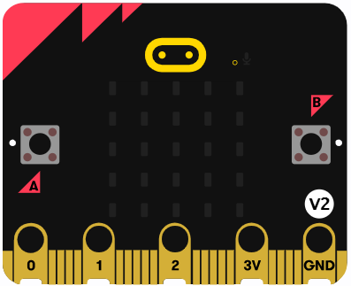
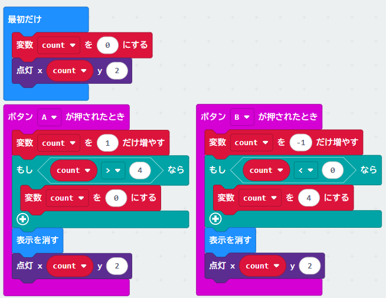

{cover}
# 🎯 条件分岐を使おう

点を動かそう

---

# なにをするの？

:::

「変数を使おう」で作ったカウンターの数を、こんどは **LEDの点の場所** に使うよ。

LED画面の場所は、**横が x**、**たてが y** の数字で決まっているんだ。どちらも **0〜4** だよ。

- Aボタンで x が 1 増えて、点が **右** に動く
- Bボタンで x が 1 減って、点が **左** に動く

そして、端まで行ったらどうするかを「**もし〜なら**」で決めるよ。

> 「明るさをはかろう」で使った「もし〜なら」を、もう一度使うよ。

:::

---

# ① 点を表示しよう

:::

「変数を使おう」のプログラムのつづきから作るよ。

1. Aボタンの「**数を表示**」を消す
2. かわりに「**基本**」の「**表示を消す**」と「**LED**」の「**点灯 x: 0 y: 0**」を入れる
3. 「点灯」の x に「**count**」を入れて、y を `2` にする
4. Bボタンも同じにする
5. 「**最初だけ**」にも「**点灯 x: count y: 2**」を足す。`0` を `2` にするとまん中スタート

> 「表示を消す」で前の点を消してから、新しい場所に点けるんだ。

:::

---

# ② 端まで動かすと…？

:::

「**ダウンロード**」で書きこんで、Aボタンを押してみよう。

- 点が右に動いて、**右端（x = 4）** まで来る
- そこで **もう1回** 押すと… 点が **消えてしまう**！

> x が 5 になると LED画面の外なので、何も表示されないんだ。count はそのまま増えつづけているよ。

こんなときは「**もし** 5 になったら **0 にもどす**」というルールを足せば、点が反対側からワープして出てくるよ。

:::

---

# ③ 「もし」で端のルールを決めよう

:::

1. 「**論理**」の「**もし〜なら**」を、Aボタンの「1 だけ増やす」の**すぐ下**に入れる
2. 「**くらべる**」の「**0 ＜ 0**」を条件に入れ、「**count ＞ 4**」にする
3. 「もし」の中に「**変数 count を 0 にする**」を入れる
4. Bボタンは「**もし count ＜ 0 なら count を 4 にする**」

> 「もし〜なら」は、条件が正しいときだけ中を動かすよ。

> ⚠ 「表示を消す」「点灯」より前に入れよう。

:::

---

# ためしてみよう

- **右端でAボタン** … 左端にワープ
- **左端でBボタン** … 右端にワープ

>| 💪 ワープじゃなくて **端で止まる** ようにするには？ 「count を 0 にする」のかわりに「count を 4 にする」にしてみよう。

> 💪 変数 `y` を作って、**タッチロゴ** や「**かたむけた**」で上下にも動かしてみよう。

> 💪 「ゆさぶられたとき」で **まん中にもどる** ようにしてみよう。
