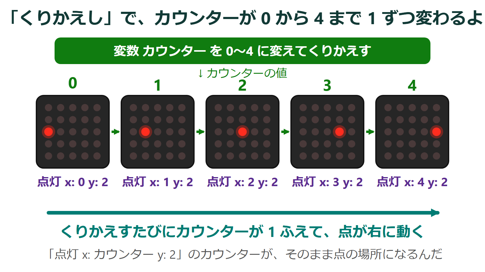
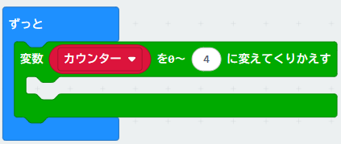
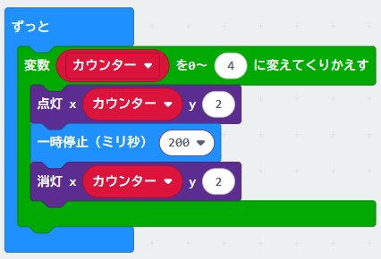

{cover}
# 🔁 くりかえしを使おう

点を流そう

---

# なにをするの？

:::

同じことを何回もやりたいときは、**くりかえし** ブロックを使うよ。

「アニメーションをつくろう」では、点が動く絵を **1枚ずつ** かいたね。くりかえしを使えば、**ブロック1つ** で点を動かせるんだ。

今回は、点が **左から右へ流れる** アニメーションを作ってみよう！

- 「くりかえし」の中で、変数 **カウンター** が 0、1、2、3、4 と変わっていく
- そのカウンターを点の x に使えば、点が動く

:::

---

# ① くりかえしブロックを置こう

:::

1. 「**新しいプロジェクト**」を作る
2. 「**ループ**」のメニューから「**変数 カウンター を 0〜4 に変えてくりかえす**」を「**ずっと**」の中にドラッグ

> 「くりかえし 4 回」というブロックもあるよ。今回は「何回目か」を変数 **カウンター** でおぼえてくれるほうを使うよ。

:::

---

# ② 点を流そう

:::

くりかえしの中に、3つのブロックを入れるよ。

1. 「**LED**」の「**点灯**」を入れて、x に「**カウンター**」、y に `2`
2. 「**基本**」の「**一時停止**」を下に入れて、`200` にする
3. 「**LED**」の「**消灯**」を下に入れて、x に「**カウンター**」、y に `2`
4. 「**ダウンロード**」で書きこもう

> 「カウンター」のブロックは「**変数**」のメニューにあるよ。

> 「ずっと」の中だから、右端まで行ったらまた左からはじまるよ。

:::

---

# ③ 速さを変えてみよう

1. 「一時停止」の `200` を `50` にしてみよう… **速く** なる
2. `500` にしてみよう… **ゆっくり** になる
3. 「消灯」のブロックを外してみよう… 点が消えないので **線がのびていく**

> 数字を1か所変えるだけで、動きが変わるね。アニメーションの絵を全部かき直すより、ずっと楽だよ。

---

# もっとやってみよう

>| 💪 **逆向き** に流そう。x に「**4 − カウンター**」を入れると、4、3、2、1、0 の順になるよ。「**計算**」の「**−**」を使うよ。

>| 💪 **全部のLEDを順番に点けよう**。くりかえしをもう1つ作って外側に置き、その変数を「点灯」の **y** に使うよ。くりかえしの中にくりかえしがある形を **二重のくりかえし** というんだ。

>| 💪 「**くりかえし 4 回**」の中に「**音楽**」の「**鳴らす**」を入れて、4回鳴らしてみよう。
