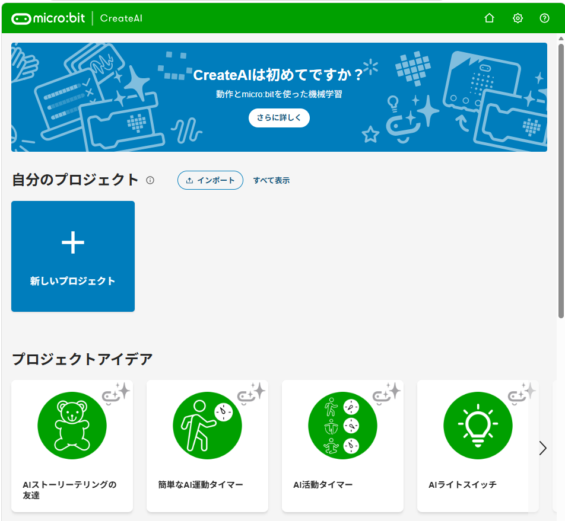
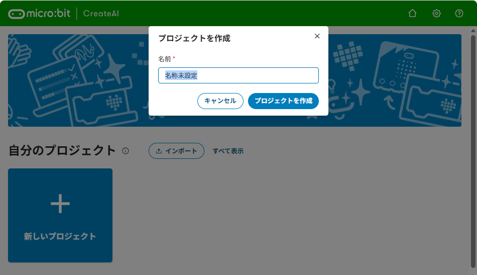
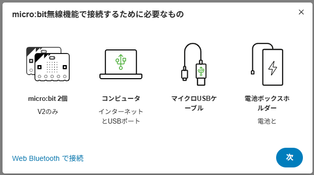
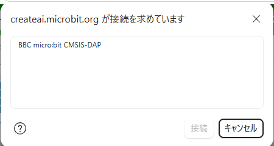
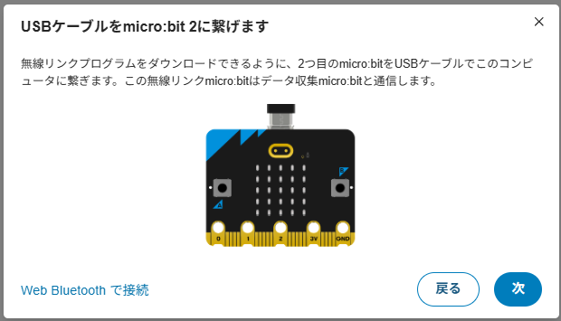
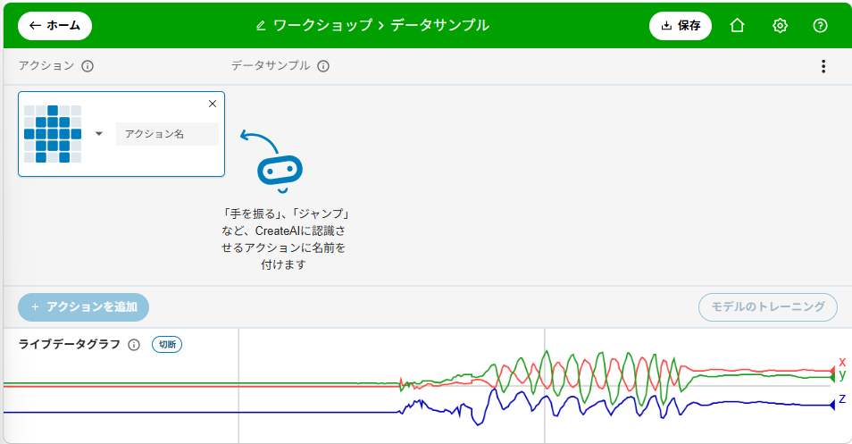
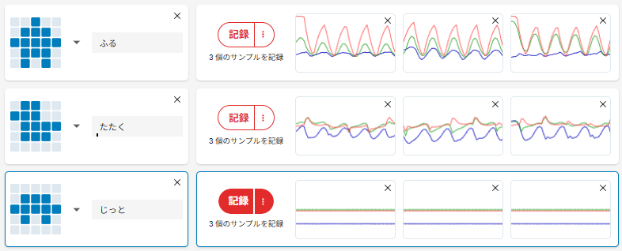
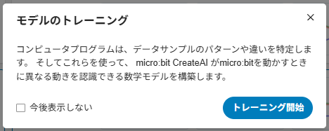
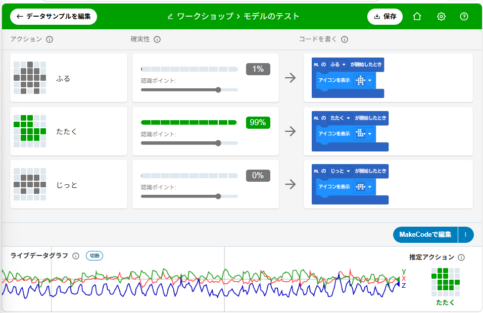

{cover}
# 🧠 AIに動きをおぼえさせよう

CreateAI で機械学習を体験しよう

---

# なにをするの？

:::

**機械学習（きかいがくしゅう）** は、コンピュータに **たくさんの例を見せて**、ルールを **自分で見つけさせる** 方法だよ。顔認識や、声で動くスピーカーもこのしくみだよ。

今回は、マイクロビットを動かした **動きのデータ** を集めて、**「ふる」「たたく」「じっと」** を見分ける AI を作るよ。

- **CreateAI（クリエイト エーアイ）** というサイトを使う
- プログラムは書かない。**動きを見せて、おぼえさせる**

> ⚠ AI を動かせるのは **micro:bit v2** だけだよ。

:::

---

# 準備しよう

:::

- マイクロビット **v2 を 2台**（記録用と橋渡し用）
- USBケーブル
- **電池ボックス**（記録用を動かすため）

1. Chrome で `https://createai.microbit.org/?l=ja` をひらく
2. 「**新しいプロジェクト**」をクリック
3. 名前を入れて「**プロジェクトを作成**」

> 記録用はふり回すので、ストラップやケースがあると持ちやすいよ。

:::

---

# マイクロビットをつなごう ①

:::

「CreateAIのやり方」の右下の「**接続**」から始めよう。まずは **記録用**（画面では micro:bit 1）から。

1. 「**micro:bit無線機能で接続するために必要なもの**」の画面で「**次**」。Bluetooth の画面が出たら、左下の「**代わりにmicro:bit無線機能を使って接続**」を押してね
2. 「USBケーブルをmicro:bit 1に繋げます」で、記録用を USB でつないで「**次**」。小さな画面で「**BBC micro:bit CMSIS-DAP**」をえらんで「**接続**」
3. 書きこみが終わったら、USB を外して **電池ボックス** につなぎ、「**次**」

:::

---

# マイクロビットをつなごう ②

:::

つぎは **橋渡し用**（画面では micro:bit 2）。記録用の動きを無線でパソコンに届ける役だよ。

1. 「USBケーブルをmicro:bit 2に繋げます」で、橋渡し用を USB でつないで「**次**」
2. 小さな画面で「**BBC micro:bit CMSIS-DAP**」をえらんで「**接続**」
3. データサンプルの画面にもどるよ。記録用を動かして **グラフがゆれたら** つながっている

> ⚠ 橋渡し用は USB につないだまま。記録用は電池で動かそう。

:::

---

# アクションを決めよう

:::

AI に見分けさせたい動きを **アクション** というよ。今回は3つ。

1. 最初のカードの「**アクション名**」に `ふる` と入れる
2. 「**＋ アクションを追加**」で、`たたく`（マイクロビットを持った手で机をトントン）と `じっと`（机に置いたまま）を足す

> 下の「**ライブデータグラフ**」は、記録用を動かすとゆれるよ。つながっているしるしだね。

> はっきりちがう動きにするのがコツだよ。似た動きは AI もまよっちゃう。

:::

---

# データを記録しよう

:::

アクションごとに、実際の動きを **記録** するよ。

1. 「ふる」の「**記録**」をクリック。記録用のマイクロビットの **Bボタン** を押してもいいよ
2. **3・2・1** のカウントダウンのあと、**約1秒** マイクロビットをふる
3. これを **5回以上** くりかえす（最低でも3回）
4. 「たたく」「じっと」も同じように記録する

> 記録するたびに、動きが **波の形** で出るよ。ほかと明らかにちがう形があったら、**×** で消そう。

:::

---

# 学習させよう

:::

集めたデータから、AI にルールを見つけさせるよ。

1. 記録が終わったら、右下の「**モデルのトレーニング**」をクリック
2. 説明が出るので「**トレーニング開始**」をクリック
3. しばらく待つと、学習が終わる

> この「学習して見つけたルール」のことを **モデル** というよ。

:::

---

# ためしてみよう

:::

学習が終わると **テスト画面** になるよ。

1. 記録用のマイクロビットを **ふって** みよう
2. 「ふる」の **確実性（かくじつせい）** のバーがのびて、右下の「**推定アクション**」が「ふる」になったら成功！ 🎉
3. 「たたく」「じっと」もためそう

> 確実性は「その動きだと思う自信」。**認識ポイント** の線をこえたら「当てた」だよ。

> 当たらないときは、そのアクションのデータを **もっと記録** して、もう一度トレーニングしよう。

:::

---

# もっとやってみよう

>| 💪 **友だちにためしてもらおう**。自分の動きでは当たるのに、友だちだと当たらないことがあるよ。どうしてかな？

>| 💪 **4つ目のアクション** を足してみよう。「ジャンプ」（電池ボックスごと持ってジャンプ）はどうかな？

>| プロジェクトはブラウザに残るけど、消えてしまうこともあるよ。右上の「**保存**」でファイルにしておくと安心だよ。
