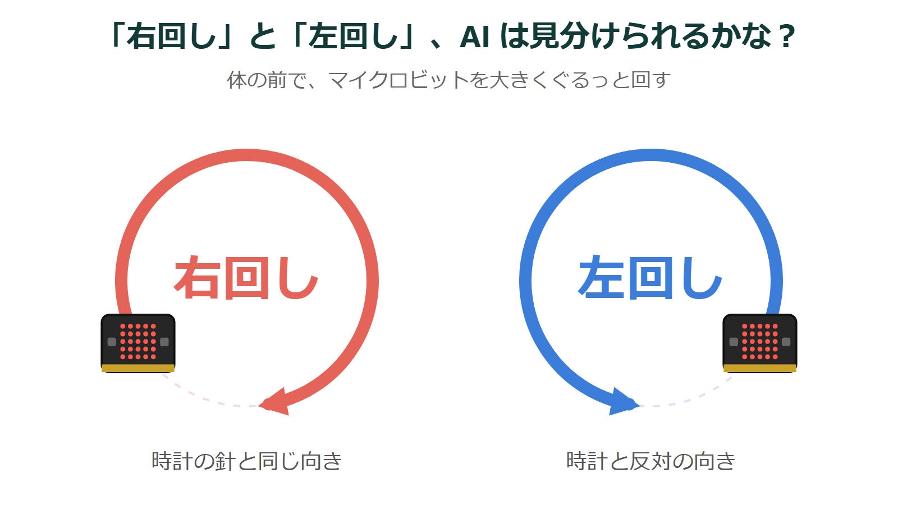
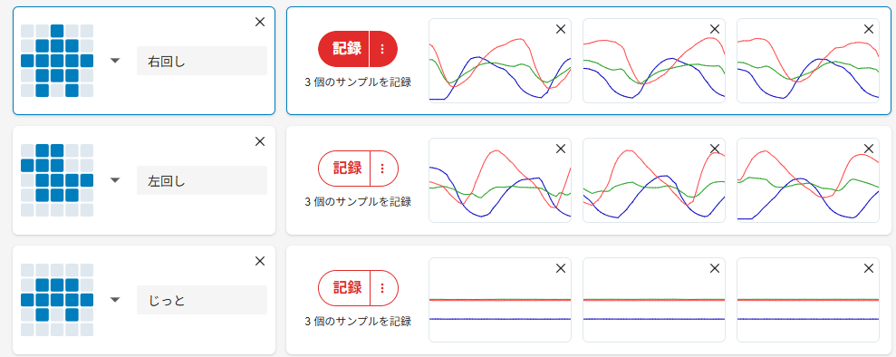
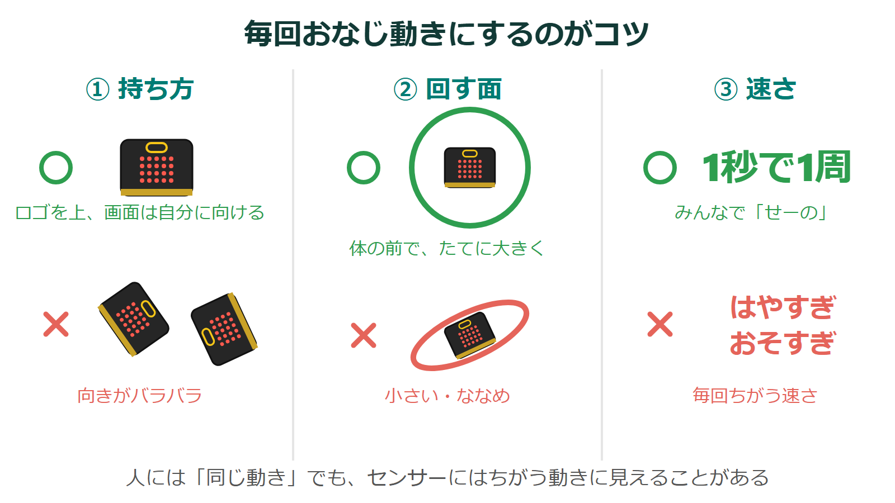
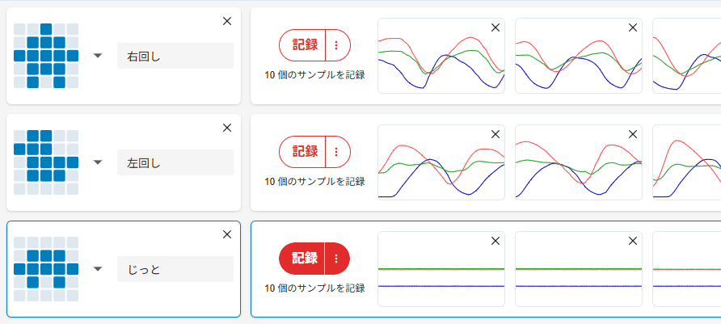
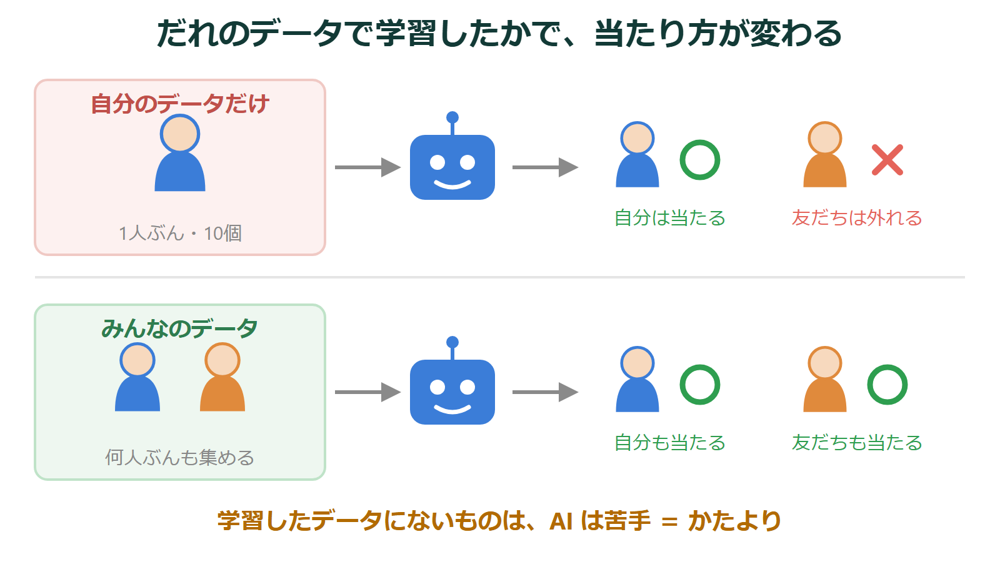
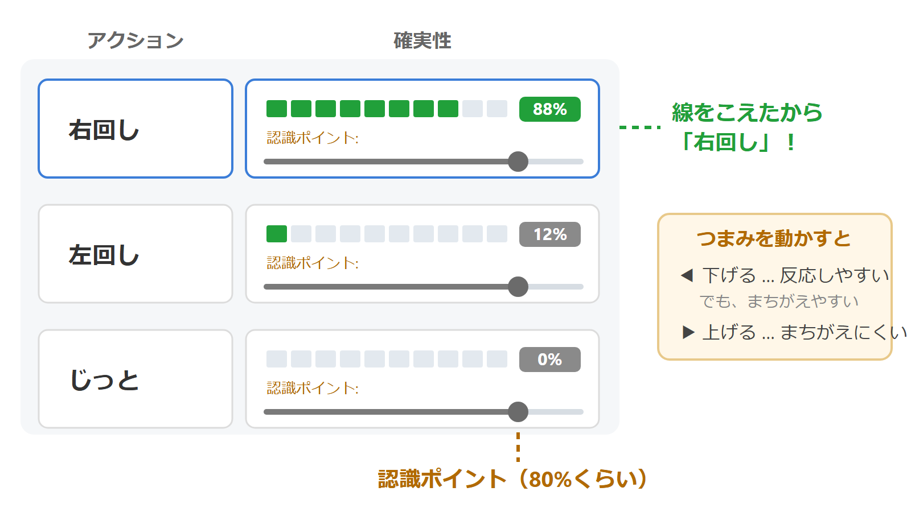

{cover}
# 🔍 AIをかしこくしよう

データの質が AI を決める

---

# なにをするの？

:::

AI のかしこさは、プログラムではなく **見せたデータ** で決まるよ。

今回はむずかしいお題。マイクロビットを **右回し** にぐるぐる回すのと、**左回し** に回すのを見分けさせよう。

- 似ている動きを AI に見分けさせるには？
- **データの集め方** を3つのコツで変えて、AI がかしこくなるのを見てみよう

> ⚠ 準備と接続は「AIに動きをおぼえさせよう」と同じだよ。

:::

---

# まずはやってみよう

:::

コツを知らないまま、いつも通りに作ってみるよ。

1. 「**新しいプロジェクト**」で、アクションを `右回し` `左回し` `じっと` の3つ作る
2. それぞれ **3回だけ** 記録する
3. 「**モデルのトレーニング**」して、テストしてみよう

> 右に回しても「左回し」と出たり、確実性が半々になったりしなかった？

> 波の形を見くらべてみよう。**右回しと左回しは、そっくり** だね。AI もまよってしまうんだ。

:::

---

# コツ①：同じ動きをそろえる

:::

人が「同じ動き」と思っていても、センサーには **ちがう動き** に見えることがあるよ。

- **持ち方** をそろえる（ロゴを上、画面を自分に向ける）
- **回す面** をそろえる（体の前で、たてに大きく）
- **速さ** をそろえる（1秒で1周くらい）

記録した波の形が **毎回にている** か、見くらべてみよう。

> 記録する前に、「せーの」で同じ動きを練習しておくといいよ。

:::

---

# コツ②：データをふやす

:::

例が多いほど、AI は **共通のルール** を見つけやすくなるよ。

1. 「右回し」「左回し」を、それぞれ **10回以上** 記録する
2. 形がおかしい波は **×** で消す
3. もう一度「**モデルのトレーニング**」して、テストしよう

> さっきより当たるようになったかな？ 確実性のバーの動きをくらべてみよう。

:::

---

# コツ③：いろいろな人のデータ

:::

自分のデータだけで学習した AI は、**友だちの動き** だと当たらないことがあるよ。

1. 友だちにも「右回し」「左回し」を **5回ずつ** 記録してもらう
2. もう一度トレーニングして、**おたがいの動き** でテストしよう

> 学習に使ったデータに **ない** ものは、AI は苦手。これを **かたより** というよ。本物の AI でも、データがかたよっていると、まちがえたり、不公平になったりするんだ。

:::

---

# 認識ポイントを調整しよう

:::

テスト画面の **認識ポイント** は、確実性がどこをこえたら「当てた」とするかの線だよ。ふつうは **80%** くらい。

- **下げる** … 反応しやすくなるけど、まちがえやすい
- **上げる** … まちがえにくいけど、反応しにくい

> どのくらいが「右回し」と「左回し」を見分けるのにちょうどいいか、動かしながらさがしてみよう。

:::

---

# ふりかえり

AI をかしこくするコツは、プログラムを直すことではなくて **データ** だったね。

- **同じ動きをそろえる**
- **データをふやす**
- **いろいろな人のデータを集める**

>| 💪 ほかにも「区別がむずかしそうな動き」を考えてみよう。「歩く」と「走る」は？ 「大きくふる」と「小さくふる」は？

>| 💪 わざと **変な動き** を混ぜて記録すると、AI はどうなる？ データを **へらす** とどうなる？ 実験してみよう。

>| 本物の AI も同じ。どんなデータで学習したかで、かしこさも、まちがい方も決まるんだ。
