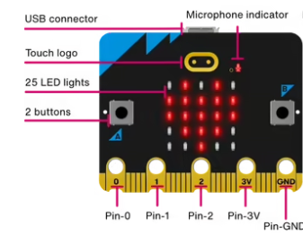
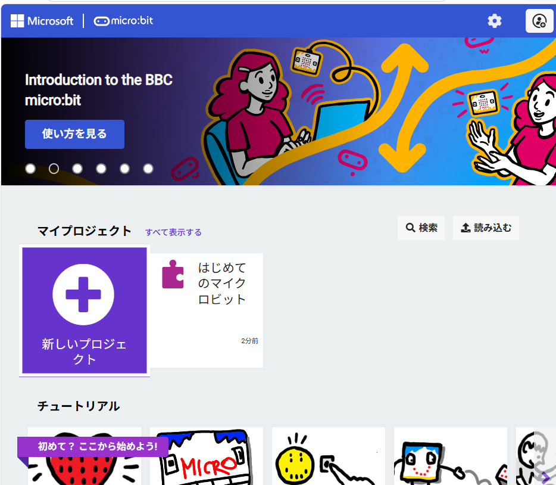
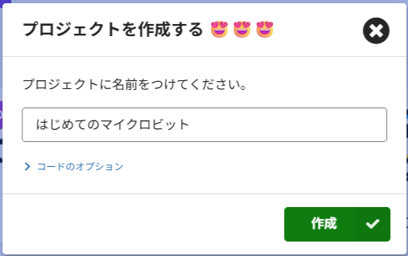
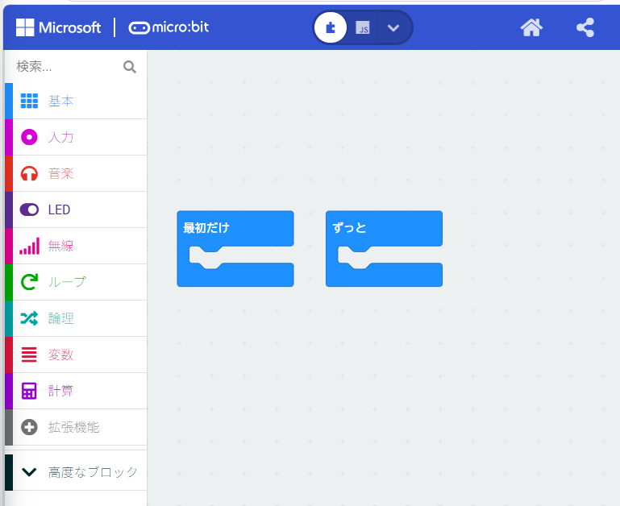
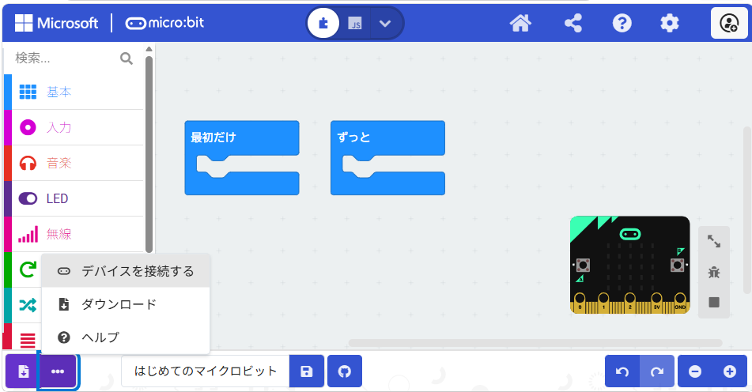
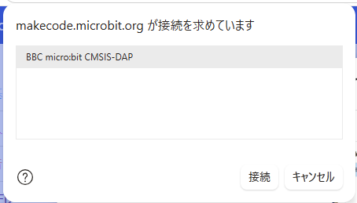
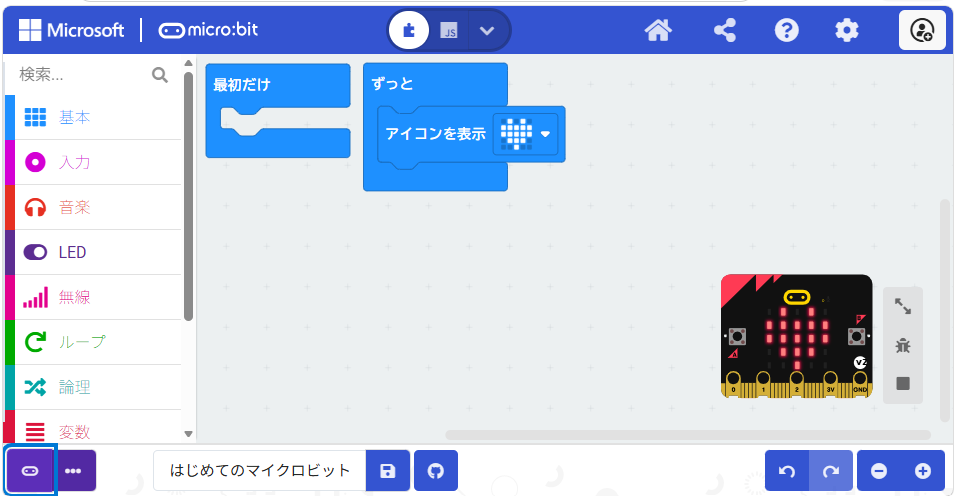

{cover}

# マイクロビットの紹介と使い方

---

# マイクロビットってなに？

:::

マイクロビットは、イギリスの公共放送 **BBC** がつくった、勉強のための小さなコンピュータだよ。

この小さなボードに、光ったり・音が鳴ったり・動きを感じたりする機能がたくさん詰まっているんだ。

- 25個の **LED**（光る画面）
- **A・B の2つのボタン**
- 音を鳴らす **スピーカー** とマイク
- かたむきをしらべる **センサー**

> もっといろいろな機能があるよ。これから一緒に、どんなことができるか試していこう！

:::

---

# メイクコードをひらこう

:::

プログラムは **メイクコード** というWebサイトで作るよ。

1. ブラウザで `https://makecode.microbit.org` をひらく
2. 「**新しいプロジェクト**」をクリック

> 「makecode」で検索してもたどりつけるよ。うまく開けないときはメンターによんでね。

:::

---

# プロジェクトに名前をつけよう

:::

1. 好きな名前を入力する（例：`はじめてのマイクロビット`）
2. 「**作成**」をクリック

> プログラム作成画面が開いたら大成功！ 🎉

:::

---

# マイクロビットをパソコンにつなごう ①

:::

マイクロビットとパソコンをつなぐよ。

1. USBケーブルで、マイクロビットとパソコンをつなぐ
2. 画面 左下の「**・・・**」をクリック
3. 「**デバイスを接続する**」をえらぶ
4. でてきた画面で「**次へ**」をクリック
5. でてきた画面で「**ペア**」をクリック

:::

---

# マイクロビットをパソコンにつなごう ②

:::

1.  `BBC micro:bit CMSIS-DAP` をえらぶ
2. 「**接続**」をクリック
3. 接続されたら「**完了**」をクリック

> ⚠ エラーが出たり、名前が見つからないときは、メンターに相談してね。一度つないだら次からは自動でつながるよ。

:::

---

# はじめてのプログラムを作ろう

:::

画面に **ハート** を表示させてみよう。

1. 「**基本**」のメニューをクリック
2. 「**アイコンを表示**」ブロックを「**ずっと**」の中にドラッグ
3. アイコンの ▼ をクリックして **ハート** をえらぶ

> 画面上でもシミュレータで動作が見えるよ。
:::

---

# マイクロビットに書きこもう

:::

作ったプログラムを、マイクロビットに送るよ。

1. 画面 左下の むらさきのボタンをクリック
2. マイクロビットの画面に **ハート ♥** が出たら大成功！ 🎉

> むらさきのボタンは「**ダウンロード**」と表示されることもあるよ。

> いろいろなアイコンを試してみよう。プログラムを変えたらダウンロードしてね。

:::

