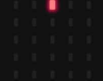
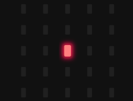
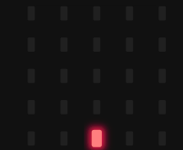
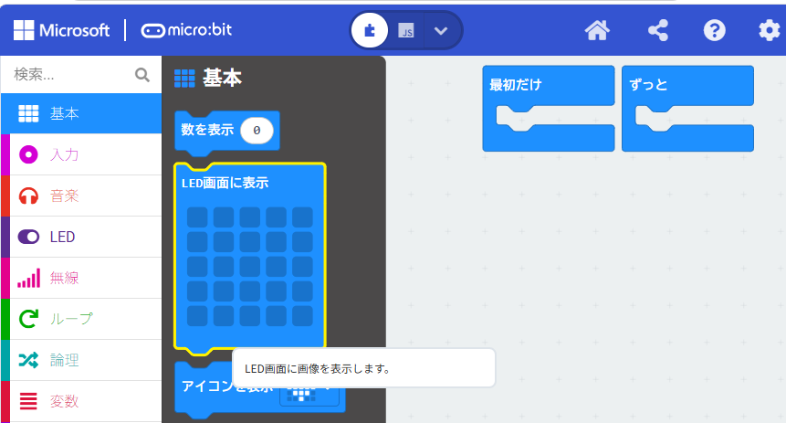
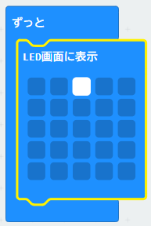
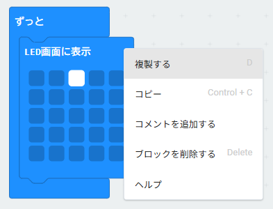
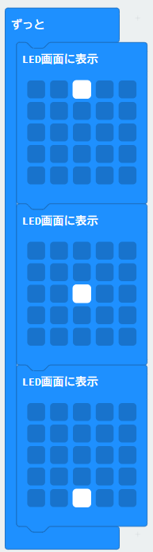
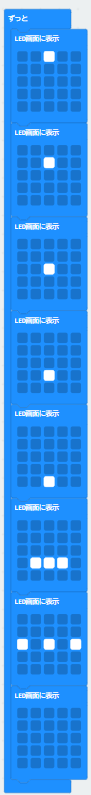
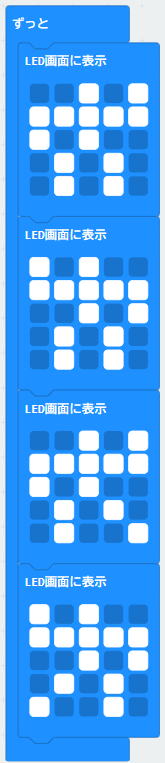
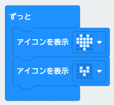

{cover}
# アニメーションをつくろう

---

# なにをするの？

:::

**少しずつ形や場所のちがう絵**を順番に表示すると、動いて見えるよ。パラパラまんがと同じしくみだね。

マイクロビットの **LED画面（25個のライト）** でも、同じようにアニメーションを作れるんだ。

まずは点が下に落ちていくアニメーションを作ってみよう！

:::

---

# ブロックを置こう

:::

1. 「**基本**」のメニューをクリック
2. 「**LED画面に表示**」ブロックを「**ずっと**」の中にドラッグ

:::

---

# 1まい目の絵をかこう

:::

1. LED画面の **小さな四角をクリック**して絵をかく

> もう一度クリックすると消えるよ

:::

---

# 絵を増やして動かそう

:::

1. 「LED画面に表示」ブロックを**右クリック**して「**複製する**」をえらぶ
2. 複製したブロックを、1つ目のブロックの下にドラッグしてつなげる
3. 複製したブロックの絵を書き換える
4. 同じように3つ目のブロックを作り、絵を書き換える

> うまく動いたかな？ 絵をふやすと、もっとなめらかに動いたり、複雑な動きもできるよ。

:::

---

# いろいろなアニメーションを作ってみよう

:::

> おもしろい動きを探してみよう。

> アイコンも使えるよ。

:::

