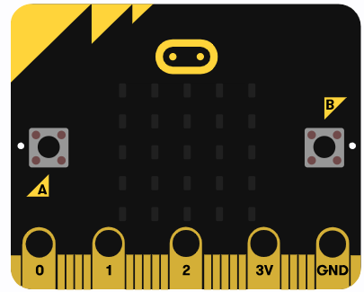
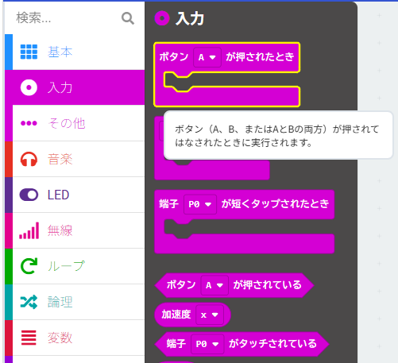
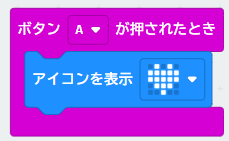
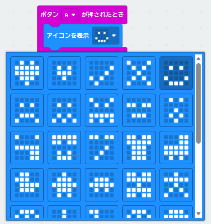
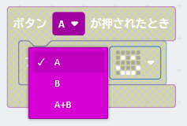
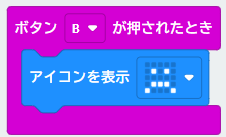
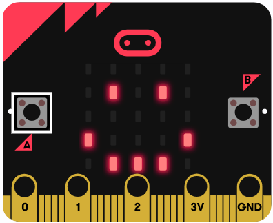
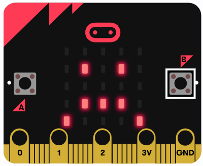

{cover}
# ボタンで表示を変えよう

---

# なにをするの？

:::

マイクロビットには **Aボタン** と **Bボタン** の2つのボタンがあるよ。**同時押し**もできるんだ。

ボタンを使うと、LEDの表示を変えたり、音を鳴らしたり、プログラムの動きを変えたりできるよ。

> 表側のまるいマーク（**タッチロゴ**）も、ボタンのように使えるよ。

:::

---

# ボタンを使おう

:::

1. 「**入力**」のメニューをクリックし、「**ボタンAが押されたとき**」ブロックを置く
2. 「**基本**」から「**アイコンを表示**」ブロックを、その中にドラッグ

> 「最初だけ」と「ずっと」の中は、空っぽにしておこう。

:::

---

# アイコンを変えよう

:::

1. アイコンをクリックして、**すきなアイコン**にかえる

:::

---

# Bボタンのアイコンも設定しよう

:::

1. 「ボタンAが押されたとき」を右クリックして複製する
2. 複製したほうの「**A**」をクリックして「**B**」に変える
3. アイコンをクリックして、ちがうアイコンにかえる

:::

---

# ためしてみよう

:::

むらさきの「**ダウンロード**」で書きこんだら、ボタンを押してみよう。

- **Aボタン**を押すと… 1つ目のアイコン
- **Bボタン**を押すと… 2つ目のアイコン

> うまくいったかな？ 「A+B（同時押し）」のブロックもふやしてみよう。

:::

