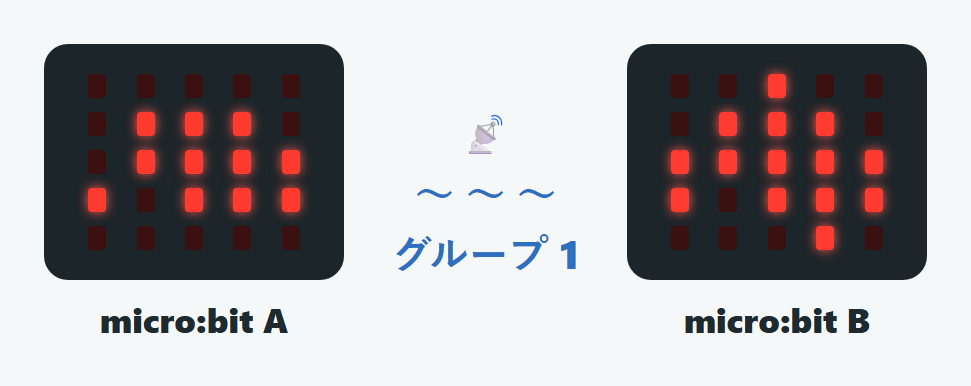
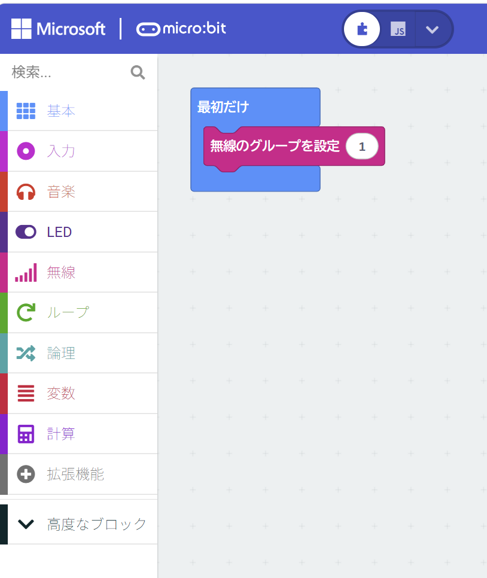
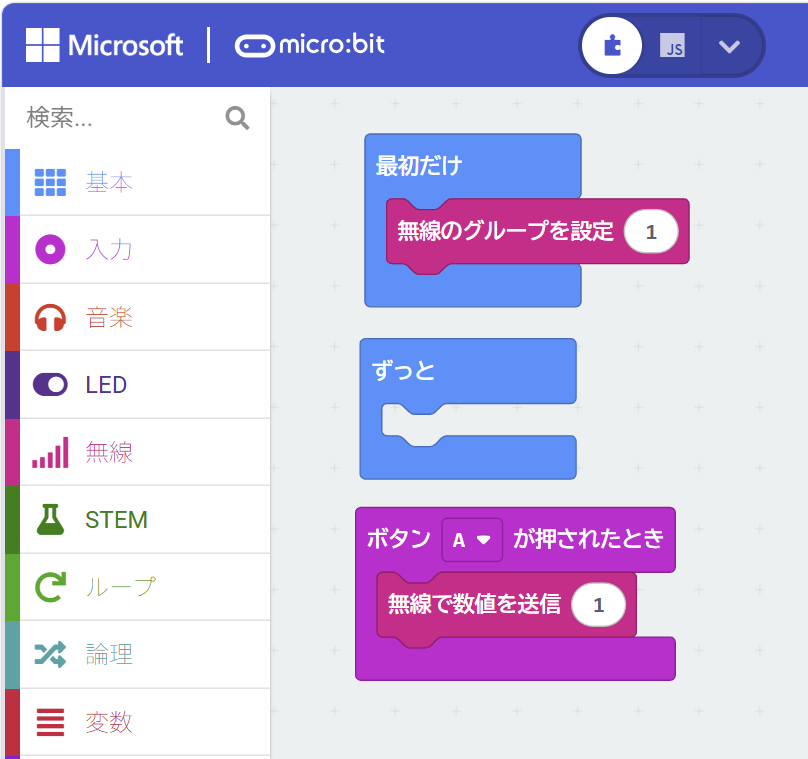
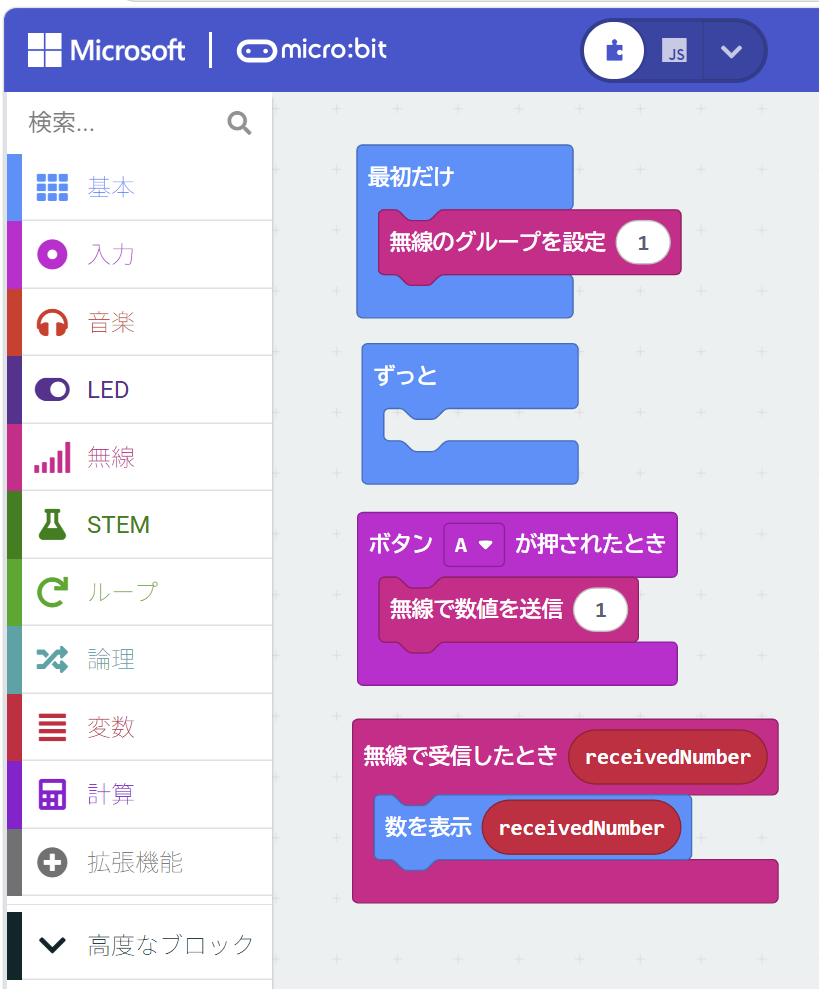
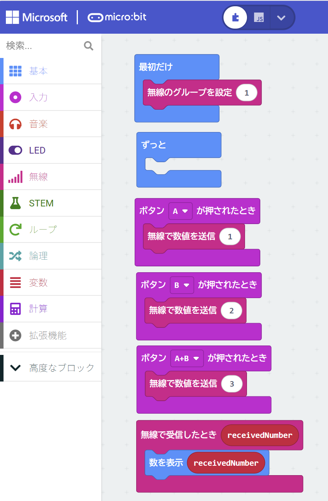

{cover}
# 📡 無線で通信しよう

---

# なにをするの？

:::

マイクロビットには **無線（むせん）** の機能があって、**2台以上のマイクロビット** で電波を使ってメッセージを送り合えるよ。

- 送る側と受け取る側の **グループ番号を同じ**にすると、お話しできる
- ちがうグループには聞こえないから、近くでたくさん使っても混ざらないよ

友だちのマイクロビットと一緒にためしてみよう！

:::

---

# ① グループを合わせよう

:::

まず、話す相手と **同じグループ番号** にそろえるよ。

1. 「**無線**」のメニューから「**無線のグループを設定**」を「**最初だけ**」の中に入れる
2. 番号を決める（れい：`1`）

> ⚠ 送る人と受け取る人、**両方のマイクロビット** に同じ番号を入れてね。番号がちがうと通じないよ。

> ⚠ 隣の人と同じ番号にならないように、1以外の数字を使おう。

:::

---

# ② メッセージを送ろう

:::

ボタンをきっかけに、数字を送ってみよう。

1. 「**入力**」から「**ボタンAが押されたとき**」を置く
2. 「**無線**」から「**無線で数値を送信**」を中に入れる
3. 送る数字を決める（例：`1`）

:::

---

# ③ メッセージを受け取ろう

:::

今度は、受け取ったときの動きを決めるよ。

1. 「**無線**」から「**無線で受信したとき**」を置く
2. 「**基本**」から「**数を表示**」を選んで「**無線で受信したとき**」の中に入れる
3. 「**無線で受信したとき**」にある「**receiveNumber**」を「**数を表示**」の中にドラッグ＆ドロップする

これで、Aボタンを押すと、相手のマイクロビットに数字 1 が出るよ！

:::

---

# 送り合ってみよう

:::

押したボタンや動きによって違う数字を送るようにすると、相手にメッセージを伝えられるよ。

> 💪 グーチョキパーのアイコンを作ればじゃんけんゲームもできるよ。

:::

