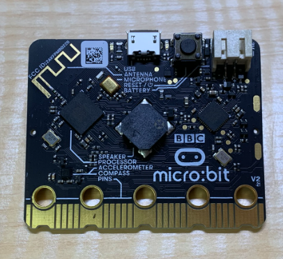
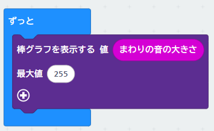
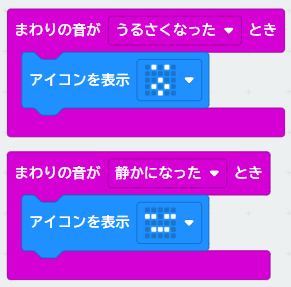
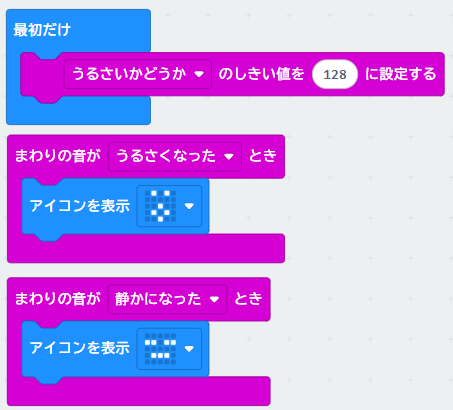

{cover}
# 🎤 音に反応させよう

---

# なにをするの？

:::

マイクロビットには **マイク** がついていて、まわりの **音の大きさ** をはかれるよ。

- 裏側の `MICROPHONE` と書いてあるところがマイク
- 表側の **左上の小さな穴** から音が入るよ。マイクが動いているときは、となりの **小さなLEDが光る**んだ
- 音の大きさは **0〜255** の数字で出てくる

今回は「**手をたたくと表示が変わる**」プログラムを作ってみよう！

> ⚠ マイクは **micro:bit v2** についているよ。v1 にはないので、自分のマイクロビットを確認してね。

:::

---

# ① 音量メーターを作ろう

:::

まずは、音の大きさを **棒グラフ** で見てみよう。

1. 「**LED**」から「**棒グラフを表示する**」を「**ずっと**」の中にドラッグ
2. 「**入力**」から「**まわりの音の大きさ**」を、「値」のところに入れる
3. 「最大値」を `255` にする
4. 「**ダウンロード**」で書きこんで、声を出したり手をたたいたりしてみよう

> 音が大きいほど、グラフがのびるよ。静かなときはどのくらいかな？ 拍手のときはどのくらいかな？

:::

---

# ② 手をたたいたらアイコンを変えよう

:::

今度は、大きな音がしたときに **アイコンが変わる** ようにするよ。ボタンのときと同じ「**〜とき**」ブロックを使うんだ。

1. さっき「ずっと」に入れたブロックは、**外して消して**おこう
2. 「**入力**」から「**まわりの音が うるさくなった とき**」を置く
3. 「**基本**」の「**アイコンを表示**」を中に入れて、びっくりした顔にする
4. もう1つ「**まわりの音が 静かになった とき**」を置いて、ねむった顔にする

> ▼ を押すと「うるさくなった」と「静かになった」をえらべるよ。

:::

---

# ③ 反応する大きさを変えよう

:::

「うるさい」と感じる大きさは、**しきい値** という数字で決まっているよ。

1. 「**入力**」の「**その他**」から「**うるさいかどうか のしきい値を 128 に設定する**」を「**最初だけ**」の中に入れる
2. 「**ダウンロード**」で書きこんで、手をたたいてみよう
3. 数字を変えて、ちょうどいいところをさがそう

> しきい値を**小さく**すると小さな音でも反応するし、**大きく**すると拍手でも反応しなくなるよ。①のメーターで見た大きさを思い出してね。

:::

---

# もっとやってみよう

> 💪 **拍手で音を返そう**：「うるさくなったとき」に「**音楽**」の「**鳴らす**」を入れてみよう。自分のスピーカーの音をマイクが聞いてしまうかも？ どうなるかためしてみよう。

> 💪 **拍手カウンター**：「**変数**」を使って、手をたたいた回数を数えて「**数を表示**」で出してみよう。変数の使い方は応用編の「変数を使おう」で学べるよ。

> 💪 **大声コンテスト**：「まわりの音の大きさ」のいちばん大きな数字をおぼえておいて、だれがいちばん大きな声か競争しよう。
