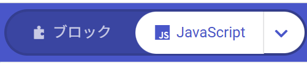

{cover}
# ① JavaScript を使ってみよう

ブロックの中身は、じつは文字のプログラム

*マイクロビット 体験ワークショップ*

---

# なにをするの？

:::

いままで作ってきた**ブロック**のプログラムは、じつは **JavaScript**（ジャバスクリプト）という
**文字のプログラム**に、そのまま変身できるんだ。

- ボタン1つで **ブロック ⇄ JavaScript** を行ったり来たりできる
- 中身は同じ。**見た目が変わるだけ**
- 文字で書けると、長いプログラムもすばやく作れる

> 世界中のアプリやゲームは、こういう「文字のプログラム」で作られているよ。今日はその入り口をのぞいてみよう！

:::

```js ブロックの「ずっと」＋「アイコンを表示」はこう書く
basic.forever(function () {
    basic.showIcon(IconNames.Heart)
})
```

---

# ① JavaScript に切りかえよう

:::

1. メイクコードで、いつもどおり**ブロックでプログラムを作る**
2. 画面の**上のまん中**にある切りかえボタンを見つける
3. 右がわの「**JavaScript**」をクリック → ブロックが**コードに変身**する
4. ブロックにもどすときは、左がわの「**ブロック**」をクリック

> 「**∨**（下向きの矢印）」を押すと、**Python**（パイソン）にも切りかえられるよ。

> ⚠ 切りかえてもプログラムは消えないよ。何度でも行ったり来たりできるから、こわがらずに押してみよう。

:::



---

# ② ブロックと JavaScript の対応

:::

このブロックを「**JavaScript**」に切りかえると、下のコードになるよ。中身はまったく同じだよ。

- 「**ボタンAが押されたとき**」→ `input.onButtonPressed(Button.A, ...)`
- 「**アイコンを表示 ♥**」→ `basic.showIcon(IconNames.Heart)`
- ブロックの**中に入れた**ものは、`{` と `}` の**あいだ**に書かれる

> 行の最初のスペース（字下げ）は、「このブロックの中だよ」という目印だよ。

:::


```js 上のブロックと同じプログラム
input.onButtonPressed(Button.A, function () {
    basic.showIcon(IconNames.Heart)
})
```

---

# よく使うブロックの早見表

:::

**基本**

- 「ずっと」→ `basic.forever(function () { })`
- 「数を表示」→ `basic.showNumber(7)`
- 「文字列を表示」→ `basic.showString("HELLO")`
- 「アイコンを表示」→ `basic.showIcon(IconNames.Heart)`
- 「一時停止」→ `basic.pause(1000)`
- 「画面を消す」→ `basic.clearScreen()`

:::

**入力・変数・くりかえし**

- 「ボタンAが押されたとき」→ `input.onButtonPressed(Button.A, ...)`
- 「ゆさぶられたとき」→ `input.onGesture(Gesture.Shake, ...)`
- 「変数 count を 0 にする」→ `let count = 0`
- 「0 から 6 までの乱数」→ `randint(0, 6)`
- 「もし〜なら」→ `if (...) { } else { }`
- 「くりかえし」→ `for (let i = 0; i < 5; i++) { }`

---

# コードをコピーして使おう

:::

この資料のコードは、**右上の「📋 コピー」ボタン**でまるごとコピーできるよ。

1. パソコンのブラウザでこのページを開く
2. コードの右上の「**📋 コピー**」をクリック
3. メイクコードを「**JavaScript**」に切りかえる
4. コードの中を全部えらんで（**Ctrl + A**）、貼りつける（**Ctrl + V**）
5. むらさきの「**ダウンロード**」で書きこむ

> ⚠ 貼りつけると、いま書いてあるコードは消えるよ。新しいプロジェクトを作ってから貼りつけるのがおすすめ。

:::

```js まずはこれを貼りつけてみよう
basic.showString("HELLO")
basic.showIcon(IconNames.Happy)
```

> 発表モードではコピーボタンは出ないよ。手元のスマホやパソコンで開いたときに使ってね。

---

# サンプル①　ドキドキするハート

:::

大きいハートと小さいハートを、かわりばんこに表示するよ。

- `basic.forever` は「**ずっと**」＝ずっとくりかえす
- `basic.pause(300)` は **0.3秒まつ**（1000 で1秒）

> 💪 `300` の数字を変えると、ドキドキの速さが変わるよ。試してみよう！

:::

```js ハートがドキドキする
basic.forever(function () {
    basic.showIcon(IconNames.Heart)
    basic.pause(300)
    basic.showIcon(IconNames.SmallHeart)
    basic.pause(300)
})
```

---

# サンプル②　ボタンで数をかぞえる

:::

**A** を押すと 1 ふえて、**B** を押すと 0 にもどるカウンターだよ。

- `let count = 0` … `count` という**入れもの（変数）**を作る
- `count += 1` … 中身を **1 ふやす**

> 💪 押すたびに 2 ずつふえるようにするには、どこを直せばいいかな？

:::

```js Aでふやす／Bでリセット
let count = 0
input.onButtonPressed(Button.A, function () {
    count += 1
    basic.showNumber(count)
})
input.onButtonPressed(Button.B, function () {
    count = 0
    basic.showNumber(count)
})
```

---

# サンプル③　ゆさぶってサイコロ

:::

マイクロビットをふると、**1〜6**の数字がランダムに出るよ。

- `input.onGesture(Gesture.Shake, ...)` … 「**ゆさぶられたとき**」
- `randint(1, 6)` … 1〜6 の**でたらめな数**

> 💪 `randint(1, 6)` を `randint(1, 100)` にすると、何が起きるかな？

:::

```js ふるとサイコロの目が出る
input.onGesture(Gesture.Shake, function () {
    let dice = randint(1, 6)
    basic.showNumber(dice)
    basic.pause(1000)
    basic.clearScreen()
})
```

---

# サンプル④　カウントダウンして GO!

:::

**A** を押すと、数字がへりながら「ピッ」と鳴って、最後に「GO!」と高い音が出るよ。

- `for` は「**くりかえし**」。`i` が 0 → 1 → 2 … と 5 回ふえる
- `5 - i` を表示するので、**5 → 1** の順にへっていく
- `music.playTone(262, 200)` … 音を鳴らす（**262**＝高さ、**200**＝0.2秒）

> ⚠ 音が鳴るのは **micro:bit v2** だけだよ。v1 のときは **P0** と **GND** にスピーカーやイヤホンをつなごう。

:::

```js カウントダウンして音を鳴らす
input.onButtonPressed(Button.A, function () {
    for (let i = 0; i < 5; i++) {
        basic.showNumber(5 - i)
        music.playTone(262, 200)
        basic.pause(300)
    }
    basic.showString("GO!")
    music.playTone(523, 400)
})
```

---

# サンプル⑤　あついかな？ さむいかな？

:::

**温度センサー**の数字で、顔を変えてみよう。

- `input.temperature()` … いまの温度（℃）
- `if ( ) { } else { }` … 「**もし〜なら〜でなければ**」

> 💪 手でマイクロビットをにぎると、温度が上がるよ。何度でニコニコ顔になるか変えてみよう。

:::

```js 28℃以上ならしょんぼり顔
basic.forever(function () {
    if (input.temperature() >= 28) {
        basic.showIcon(IconNames.Sad)
    } else {
        basic.showIcon(IconNames.Happy)
    }
    basic.pause(2000)
})
```

---

# うまく動かないときは

:::

コードは**書きかた（ルール）**にきびしいよ。赤い波線が出たらここをチェック！

- **大文字と小文字**はべつのもの　`Basic` ✗ ／ `basic` ○
- **かっこ**はいつもペア　`(` `)` `{` `}`
- **全角の記号**は使えない　`（` `”` ✗
- 文字は `"` でかこむ　`showString("HI")`

> こまったら、いちど**ブロックにもどして**みよう。どこがおかしいか見つけやすくなるよ。

:::

```js まちがいさがし（3つ見つけられるかな？）
Basic.forever(function () {
    basic.showString(HELLO)
    basic.pause(500
})
```

---

# もっとやってみよう

:::

- 自分が前に作ったプログラムを「**JavaScript**」に切りかえて、中身をのぞいてみよう
- サンプルの**数字や文字を変えて**、動きがどう変わるか実験しよう
- 「**∨**」から **Python** に切りかえて、書きかたのちがいを見くらべよう

> 💪 サンプル②と③を合体させて、「Aで数える・ふるとリセット」を作れるかな？

:::

```py Python だとこう書ける（さいしょのサンプルと同じ）
def on_forever():
    basic.show_icon(IconNames.HEART)
basic.forever(on_forever)
```
