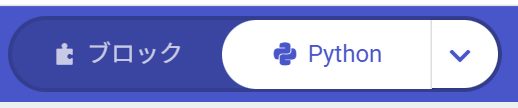
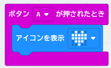

{cover}
# ② Python を使ってみよう

字下げでプログラムの形を作ろう

*マイクロビット 体験ワークショップ*

---

# なにをするの？

:::

ブロックのプログラムは、**JavaScript** だけでなく **Python**（パイソン）にも変身できるよ。

- ボタン1つで **ブロック ⇄ Python** を行ったり来たりできる
- 中身は同じ。**書きかたのルールがちがうだけ**
- Python は `{` `}` を使わず、**字下げ（スペース）でまとまりを表す**のが特徴

> Python は、AI やデータ分析でも世界中で使われている人気の言葉だよ。ここでその第一歩をふみだそう！

:::

```py ブロックの「ずっと」＋「アイコンを表示」はこう書く
def on_forever():
    basic.show_icon(IconNames.HEART)
basic.forever(on_forever)
```

---

# ① Python に切りかえよう

:::

1. メイクコードで、いつもどおり**ブロックでプログラムを作る**
2. 画面の**上のまん中**にある切りかえボタンの「**∨**」をクリック
3. 出てきたメニューから「**Python**」をえらぶ → 右がわの表示が「**Python**」に変わる
4. ブロックにもどすときは、左がわの「**ブロック**」をクリック

> ①の JavaScript と同じ切りかえボタンだよ。「JavaScript」と「Python」は「∨」でいつでも取りかえられる。

> ⚠ 切りかえてもプログラムは消えないよ。何度でも行ったり来たりできるから、こわがらずに押してみよう。

:::



---

# ② ブロックと Python の対応

:::

このブロックを「**Python**」に切りかえると、このコードになるよ。



- 「**ボタンAが押されたとき**」→ `input.on_button_pressed(...)`
- 「**アイコンを表示 ♥**」→ `basic.show_icon(IconNames.HEART)`

:::

```py 上のブロックと同じプログラム
def on_button_pressed_a():
    basic.show_icon(IconNames.HEART)
input.on_button_pressed(Button.A, on_button_pressed_a)
```

---

# Python の3つのルール

:::

**① 字下げ（インデント）がとても大事**

- `def 名前():` の**中身**は、かならず**スペース4つ**下げて書く
- 下げるのを忘れたり、そろっていないとエラーになる

**② `:`（コロン）を行のおしりに付ける**

- `def` や `if`、`for` の行は、おしりに `:` を付ける

:::

**③ `{` `}` と `;` は使わない**

- JavaScript の `{ }` の代わりが**字下げ**だよ

> ボタンやゆさぶりのブロックは、`def 名前():` で「やること」に名前をつけて、その名前を `input.on_button_pressed` にわたす形になるよ。

> JavaScript とくらべると記号が少なくてスッキリ。そのぶん**字下げがズレるとすぐ怒られる**んだ。

---

# よく使うブロックの早見表

:::

**基本**

- 「ずっと」→ `basic.forever(関数名)`
- 「数を表示」→ `basic.show_number(7)`
- 「文字列を表示」→ `basic.show_string("HELLO")`
- 「アイコンを表示」→ `basic.show_icon(IconNames.HEART)`
- 「一時停止」→ `basic.pause(1000)`
- 「画面を消す」→ `basic.clear_screen()`

:::

**入力・変数・くりかえし**

- 「ボタンAが押されたとき」→ `input.on_button_pressed(Button.A, 関数名)`
- 「ゆさぶられたとき」→ `input.on_gesture(Gesture.SHAKE, 関数名)`
- 「変数 count を 0 にする」→ `count = 0`
- 「0 から 6 までの乱数」→ `randint(0, 6)`
- 「もし〜なら」→ `if ...:` と `else:`
- 「くりかえし」→ `for i in range(5):`

---

# コードをコピーして使おう

:::

この資料のコードは、**右上の「📋 コピー」ボタン**でまるごとコピーできるよ。

1. パソコンのブラウザでこのページを開く
2. コードの右上の「**📋 コピー**」をクリック
3. メイクコードを「**Python**」に切りかえる
4. コードの中を全部えらんで（**Ctrl + A**）、貼りつける（**Ctrl + V**）
5. むらさきの「**ダウンロード**」で書きこむ

> ⚠ 貼りつけると、いま書いてあるコードは消えるよ。新しいプロジェクトを作ってから貼りつけるのがおすすめ。

:::

```py まずはこれを貼りつけてみよう
basic.show_string("HELLO")
basic.show_icon(IconNames.HAPPY)
```

> 発表モードではコピーボタンは出ないよ。手元のスマホやパソコンで開いたときに使ってね。

---

# サンプル①　ドキドキするハート

:::

大きいハートと小さいハートを、かわりばんこに表示するよ。

- `def on_forever():` … 「**ずっと**」やることに名前をつける
- `basic.forever(on_forever)` … その名前をわたして、ずっとくりかえす

> 💪 `300` の数字を変えると、ドキドキの速さが変わるよ。試してみよう！

:::

```py ハートがドキドキする
def on_forever():
    basic.show_icon(IconNames.HEART)
    basic.pause(300)
    basic.show_icon(IconNames.SMALL_HEART)
    basic.pause(300)
basic.forever(on_forever)
```

---

# サンプル②　ボタンで数をかぞえる

:::

**A** を押すと 1 ふえて、**B** を押すと 0 にもどるカウンターだよ。

- `count = 0` … `count` という**入れもの（変数）**を作る
- `global count` … 「**外にある入れものを使うよ**」という合図（Python のお約束）

> 💪 押すたびに 2 ずつふえるようにするには、どこを直せばいいかな？

:::

```py Aでふやす／Bでリセット
count = 0
def on_button_pressed_a():
    global count
    count += 1
    basic.show_number(count)
input.on_button_pressed(Button.A, on_button_pressed_a)
def on_button_pressed_b():
    global count
    count = 0
    basic.show_number(count)
input.on_button_pressed(Button.B, on_button_pressed_b)
```

---

# サンプル③　ゆさぶってサイコロ

:::

マイクロビットをふると、**1〜6**の数字がランダムに出るよ。

- `input.on_gesture(Gesture.SHAKE, ...)` … 「**ゆさぶられたとき**」
- `randint(1, 6)` … 1〜6 の**でたらめな数**

> 💪 `randint(1, 6)` を `randint(1, 100)` にすると、何が起きるかな？

:::

```py ふるとサイコロの目が出る
def on_gesture_shake():
    dice = randint(1, 6)
    basic.show_number(dice)
    basic.pause(1000)
    basic.clear_screen()
input.on_gesture(Gesture.SHAKE, on_gesture_shake)
```

---

# サンプル④　カウントダウンして GO!

:::

**A** を押すと、数字がへりながら「ピッ」と鳴って、最後に「GO!」と高い音が出るよ。

- `for i in range(5):` は「**5回くりかえし**」。`i` が 0 → 1 → 2 … と変わる
- `5 - i` を表示するので、**5 → 1** の順にへっていく
- `music.play_tone(262, 200)` … **262**の高さの音を **0.2秒**鳴らす（数字が大きいほど高い音）

> `for` の中は**もう1段ふかく**字下げするよ。字下げの深さが「どこまでがくりかえしか」を表しているんだ。

:::

```py カウントダウンして音を鳴らす
def on_button_pressed_a():
    for i in range(5):
        basic.show_number(5 - i)
        music.play_tone(262, 200)
        basic.pause(300)
    basic.show_string("GO!")
    music.play_tone(523, 400)
input.on_button_pressed(Button.A, on_button_pressed_a)
```

---

# サンプル⑤　あついかな？ さむいかな？

:::

**温度センサー**の数字で、顔を変えてみよう。

- `input.temperature()` … いまの温度（℃）
- `if ...:` と `else:` … 「**もし〜なら〜でなければ**」

> 💪 手でマイクロビットをにぎると、温度が上がるよ。何度でニコニコ顔になるか変えてみよう。

:::

```py 28℃以上ならしょんぼり顔
def on_forever():
    if input.temperature() >= 28:
        basic.show_icon(IconNames.SAD)
    else:
        basic.show_icon(IconNames.HAPPY)
    basic.pause(2000)
basic.forever(on_forever)
```

---

# うまく動かないときは

:::

Python は**字下げ**にとてもきびしいよ。赤い波線が出たらここをチェック！

- **字下げ**はそろってる？　スペース**4つ**でそろえる
- 行のおしりの **`:`** を忘れてない？
- **全角のスペース**は使えない（見た目でわからないので注意）
- **大文字と小文字**はべつのもの　`Basic` ✗ ／ `basic` ○

> こまったら、いちど**ブロックにもどして**みよう。どこがおかしいか見つけやすくなるよ。

:::

```py まちがいさがし（3つ見つけられるかな？）
def on_forever()
    basic.show_string(HELLO)
  basic.pause(500)
basic.forever(on_forever)
```

---

# もっとやってみよう

:::

- 自分が前に作ったプログラムを「**Python**」に切りかえて、中身をのぞいてみよう
- 同じプログラムを「**JavaScript**」にも切りかえて、**書きかたを見くらべよう**
- サンプルの**数字や文字を変えて**、動きがどう変わるか実験しよう

> 💪 サンプル②と③を合体させて、「Aで数える・ふるとリセット」を作れるかな？

:::

```js JavaScript だとこう書ける（サンプル①と同じ）
basic.forever(function () {
    basic.showIcon(IconNames.Heart)
})
```

> 同じことを、Python は**字下げ**で、JavaScript は **`{ }`** で表しているだけなんだ。
