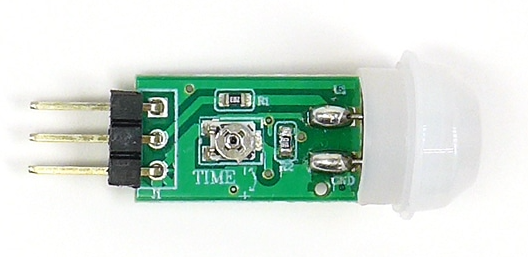
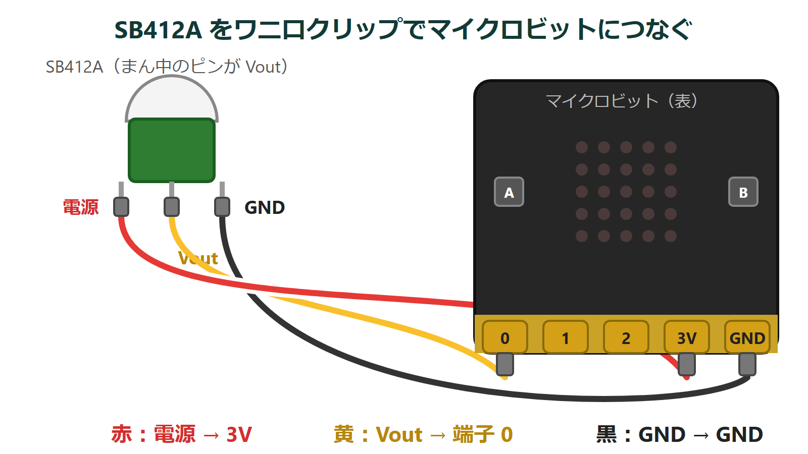
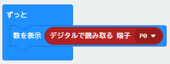
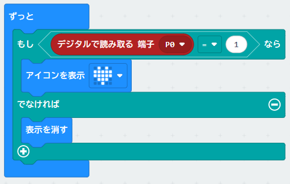
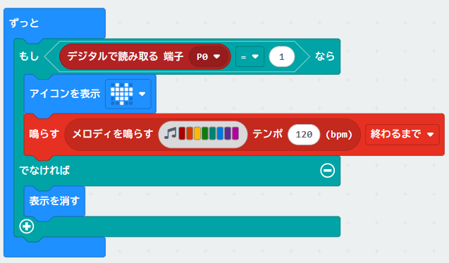

{cover}
# ② 人感センサーを使ってみよう

人を検知して光や音で知らせよう

---

# なにをするの？

:::

**人感センサー** は、人のからだから出る **赤外線（熱）** の動きを見つけるセンサーだよ。トイレや玄関の **自動照明** に使われているんだ。

今回使うのは **SB412A** というセンサーだよ。

- **5m** くらい先まで、**115°** の広さで見ている
- 人を見つけると、出力が **数秒間 ON** になる
- マイクロビットには **3本の線** でつなぐだけ

人を検知したら **LEDを光らせたり、音を鳴らしたり** してみよう！

:::

---

# センサーをつなごう

:::

**3本のピン** を、ワニ口クリップでマイクロビットにつなぐよ。

1. **電源（はし）** … マイクロビットの **3V**
2. **Vout（まん中）** … マイクロビットの **端子 0**
3. **GND（はし）** … マイクロビットの **GND**

> ⚠ ピンが近いので、ワニ口クリップどうしがふれないようにしよう。

> つないだ直後は、落ち着くまで 1分くらい待ってからためそう。

:::

---

# ① センサーの値を見よう

:::

まずは、センサーが何を出しているか数字で見てみよう。

1. 「**高度なブロック**」を開いて「**入出力端子**」をクリック
2. 「**基本**」の「**数を表示**」を「**ずっと**」に入れる
3. 「**入出力端子**」の「**デジタルで読み取る 端子 P0**」を、数字のところに入れる
4. 「**ダウンロード**」で書きこんで、センサーの前で手を動かしてみよう

> 人が動くと **1**、じっとしていると **0** になるよ。動きが止まっても、数秒は 1 のままだね。

:::

---

# ② 人が来たら光らせよう

:::

「もし 1 なら光る、でなければ消す」にするよ。明るさの章と同じ形だね。

1. 「数を表示」を消す
2. 「**論理**」の「**もし〜なら〜でなければ**」を入れる
3. 「**くらべる**」の「**0 ＝ 0**」を入れて、「**デジタルで読み取る 端子 P0 ＝ 1**」にする
4. 「もし」に「**アイコンを表示**」、「でなければ」に「**表示を消す**」

> 人が来たらハート、いなくなったら消える。自動照明のできあがり！

:::

---

# ③ 音で知らせよう

:::

人が来たら、音でも知らせてみよう。

1. 「もし」の中の「アイコンを表示」の下に、「**音楽**」の「**鳴らす**」を入れる
2. 好きなメロディをえらぶ
3. 「**ダウンロード**」で書きこんで、センサーの前を通ってみよう

> センサーが 1 のあいだは、メロディが何度も鳴るよ。

> 💪 1回だけ鳴らすには？ 「鳴らす」の下に「**一時停止（ミリ秒）**」を入れて `5000` にしてみよう。

:::

---

# もっとやってみよう

>| 💪 **通った人を数えよう**：「変数」で回数を数えて「数を表示」で出そう。応用編の「変数を使おう」を思い出してね。

>| 💪 **本物の自動照明**：「明るさ」と組み合わせて、**暗いとき** に人が来たときだけ光らせよう。「論理」の「**かつ**」を使うよ。

>| 💪 **見はり番**：人を検知したら「無線」で別のマイクロビットに知らせよう。はなれた場所でアラームが鳴るよ。

>| 💪 **ON の長さを変えよう**：センサーの基板の **TIME** と書かれた小さなねじを回すと、1 のままでいる時間が変わるよ。メンターと一緒にためしてね。
