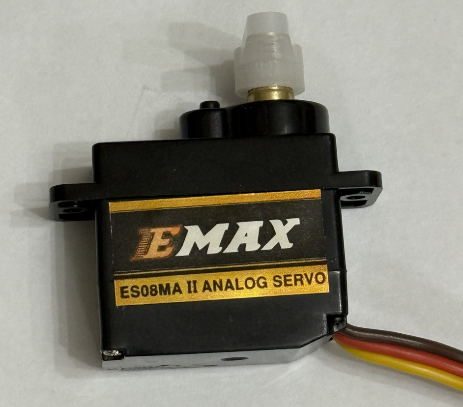
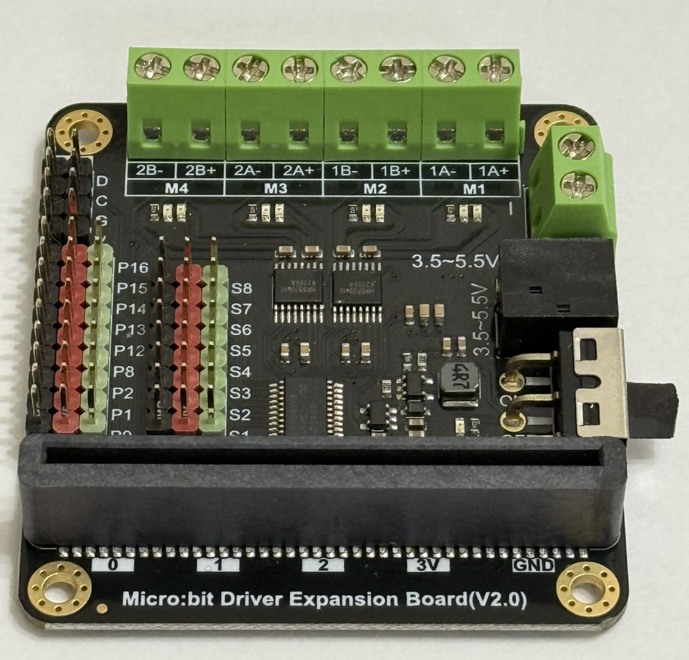
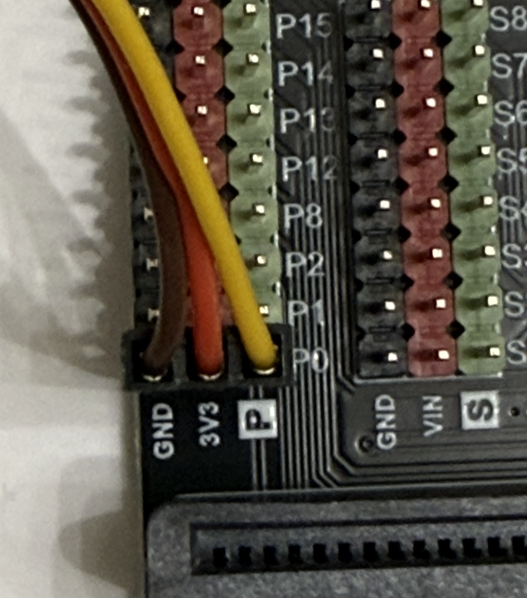

{cover}
# サーボモーターを動かそう

角度を指定してうごかそう

---

# なにをするの？

:::

サーボモーターは、**角度（0〜180度）を指定して**その位置でピタッと止まるモーターだよ。ロボットの腕やしっぽ、ハンドルなどに使えるんだ。

- （ポイント1：ふつうのモーターとのちがい ＝ 角度で止められる）
- （ポイント2：ここに書く）

:::

---

# サーボモーターをつなごう

:::

サーボには **3本の線** があるよ。

1. 茶（または黒）… **GND（−）**
2. 赤 … **電源（3V）**
3. 黄（または橙）… **信号** → 端子 **P0**

マイクロビットとサーボモーターをつなぐために写真のような拡張基板を使うよ。

> ⚠ 線の色と向きに注意。わからないときはメンターと一緒に確かめよう。

:::

---

# 角度を指定して動かそう

:::

1. 「**高度なブロック**」→「**入出力端子**」をひらく
2. 「**サーボ 出力する 端子 P0 角度 90**」を「**最初だけ**」に入れる
3. 角度を **0 → 90 → 180** に変えて、動きを見てみよう

> 💪 やってみよう！　0度と180度で、どれくらい動くかな？

:::

📷 ここにプログラム画面を貼り付け

---

# ボタンで角度を変えよう

:::

（ここに手順を書く）

1. 「**入力**」→「**ボタンAが押されたとき**」で角度を **0** に
2. 「**ボタンBが押されたとき**」で角度を **180** に

> 💪 やってみよう！　少しずつ角度を増やして、往復（スイープ）させられるかな？

:::

📷 ここにプログラム画面を貼り付け
